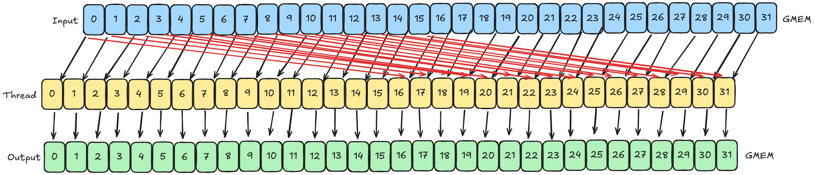
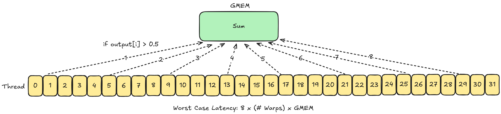
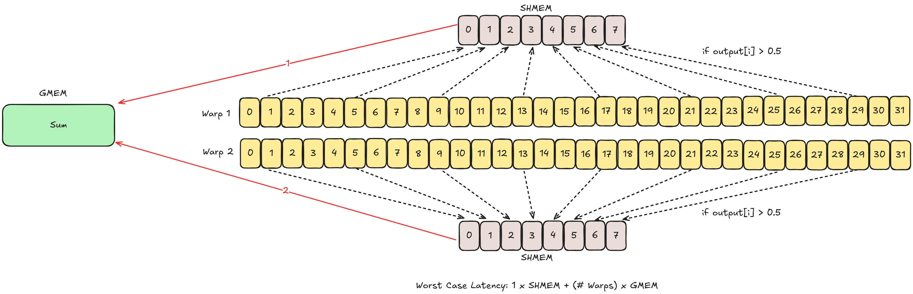
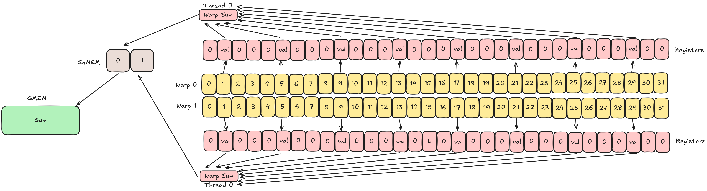
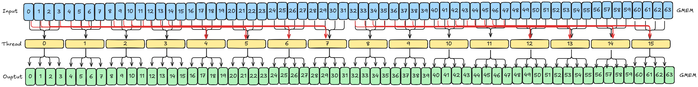
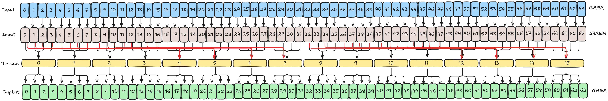

# README - Detailed

**Note:** The following numbers are from an RTX 3090, which is different from the H100 used in [README.md](./README.md).

## Program 1: Naive

| Type                    | Speed    | Bandwidth |
| :-----------------------| :-------:| --------: |
| Computation + Reduction | 10.85ms  | 123 GB/s  |
| Computation Only        | 5.4ms    | 247 GB/s  |
| Baseline                | 1.27ms   | 842 GB/s  |

**Memory Access Pattern: Computation**

**Memory Access Pattern: Reduction**

## Program 2: Operator Fusion
Same as Program 1

## Program 3: SHMEM as Cache for AtomicAdd
| Type                    | Speed    | Bandwidth |
| :-----------------------| :-------:| --------: |
| Computation + Reduction | 6.87ms   | 195 GB/s  |
| Computation Only        | 5.2ms    | 254 GB/s  |
| Baseline                | 1.27ms   | 842 GB/s  |

**Memory Access Pattern: Computation**  
Same as Program 1

**Memory Access Pattern: Reduction**

## Program 4: Dynamic Blocksize

| Type                    | Speed    | Bandwidth |
| :-----------------------| :-------:| --------: |
| Computation + Reduction | 4.8ms    | 277 GB/s  |
| Computation Only        | 2.2ms    | 633 GB/s  |
| Baseline                | 1.27ms   | 842 GB/s  |

**Memory Access Pattern: Computation**  
Same as Program 1

**Memory Access Pattern: Reduction**
Same as Program 3

## Program 5: Tree Reduction

| Type                    | Speed    | Bandwidth |
| :-----------------------| :-------:| --------: |
| Computation + Reduction | 3.6ms    | 375 GB/s  |
| Computation Only        | 2.2ms    | 630 GB/s  |
| Baseline                | 1.27ms   | 842 GB/s  |

**Memory Access Pattern: Computation**  
Same as Program 1

**Memory Access Pattern: Reduction**
Same as Program 3

## Program 6: Warp Reduction

| Type                    | Speed    | Bandwidth |
| :-----------------------| :-------:| --------: |
| Computation + Reduction | 4.4ms    | 300 GB/s  |
| Computation Only        | 2.2ms    | 603 GB/s  |
| Baseline                | 1.27ms   | 842 GB/s  |

**Memory Access Pattern: Computation**  
Same as Program 1

**Memory Access Pattern: Reduction**

## Program 7: Vectorize

| Type                    | Speed    | Bandwidth |
| :-----------------------| :-------:| --------: |
| Computation + Reduction | 2.6ms    | 519 GB/s  |
| Computation Only        | 2.6ms    | 510 GB/s  |
| Baseline                | 1.27ms   | 842 GB/s  |

**Memory Access Pattern: Computation**  

**Memory Access Pattern: Reduction**
Same as Program 6

**Note:** Vectorizing `i-16` access reduces kernel bandwidth to 395GB/s.

## Program 8: Final (Cached `i-16`)

| Type                    | Speed    | Bandwidth |
| :-----------------------| :-------:| --------: |
| Computation + Reduction | 1.27ms    | 1050 GB/s  |
| Computation Only        | 1.28ms    | 1040 GB/s  |
| Baseline                | 1.27ms   | 842 GB/s  |

**Memory Access Pattern: Computation**  

**Memory Access Pattern: Reduction**
Same as Program 6

### NSIGHT Compute Insights
| Metric             | Baseline | Kernel |
| :------------------| :-------:| -----: |
| Compute Throughput |   17%    | 78%    |
| Memory Throughput  |   93%    | 89%    |

* 4-way bank conflicts due to strided access: Fixed in `8_final_fp32_opt.cu` using structure of arrays instead.

### Further Potential Optimizations
* Use Shuffle Up Sync to get `i-16` values.
* Store only the 4 required elements in SHMEM.
